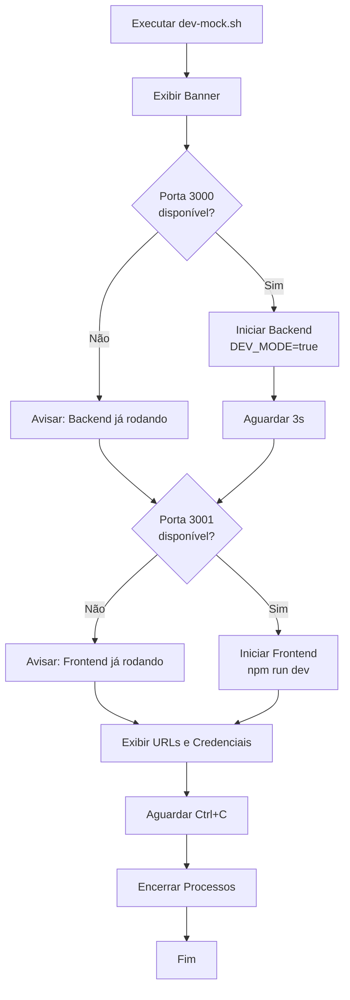

# Design Document - Fix Dev Mock Script

## Overview

Este documento descreve o design da solução para atualizar os scripts `dev-mock.sh` e `dev-mock.ps1` para iniciarem tanto o backend quanto o frontend automaticamente. A solução reutiliza a lógica já existente em `dev-full-mock.sh` e `dev-full-mock.ps1`, consolidando a experiência de desenvolvimento em um único comando intuitivo.

## Architecture

### Fluxo de Execução



## Components and Interfaces

### 1. Script Linux/Mac (dev-mock.sh)

Estrutura do script bash atualizado:

```bash
#!/bin/bash

# 1. Banner e Informações
echo "========================================"
echo "🔧 MODO DE DESENVOLVIMENTO COMPLETO"
echo "========================================"

# 2. Verificação de Portas
if lsof -Pi :3000 -sTCP:LISTEN -t >/dev/null ; then
    echo "⚠️  Backend já está rodando na porta 3000"
else
    export DEV_MODE=true
    echo "🚀 Iniciando backend (porta 3000)..."
    lein run &
    BACKEND_PID=$!
fi

# 3. Aguardar Backend
sleep 3

# 4. Verificação e Início do Frontend
if lsof -Pi :3001 -sTCP:LISTEN -t >/dev/null ; then
    echo "⚠️  Frontend já está rodando na porta 3001"
else
    echo "🌐 Iniciando frontend (porta 3001)..."
    cd frontend-nextjs
    npm run dev &
    FRONTEND_PID=$!
    cd ..
fi

# 5. Mensagem de Sucesso
echo "✅ Ambiente pronto!"
echo "Backend:  http://localhost:3000"
echo "Frontend: http://localhost:3001"
echo "Credenciais: admin@demo.com / admin123"

# 6. Aguardar Interrupção
wait
```

### 2. Script Windows (dev-mock.ps1)

Estrutura do script PowerShell atualizado:

```powershell
# 1. Banner e Informações
Write-Host "========================================" -ForegroundColor Cyan
Write-Host "🔧 MODO DE DESENVOLVIMENTO COMPLETO" -ForegroundColor Green

# 2. Verificação de Portas (Windows)
$backendRunning = Get-NetTCPConnection -LocalPort 3000 -State Listen -ErrorAction SilentlyContinue
if ($backendRunning) {
    Write-Host "⚠️  Backend já rodando" -ForegroundColor Yellow
} else {
    $env:DEV_MODE="true"
    Write-Host "🚀 Iniciando backend..." -ForegroundColor Green
    Start-Process powershell -ArgumentList "-NoExit", "-Command", "lein run"
}

# 3. Aguardar Backend
Start-Sleep -Seconds 3

# 4. Verificação e Início do Frontend
$frontendRunning = Get-NetTCPConnection -LocalPort 3001 -State Listen -ErrorAction SilentlyContinue
if ($frontendRunning) {
    Write-Host "⚠️  Frontend já rodando" -ForegroundColor Yellow
} else {
    Write-Host "🌐 Iniciando frontend..." -ForegroundColor Green
    Set-Location frontend-nextjs
    Start-Process powershell -ArgumentList "-NoExit", "-Command", "npm run dev"
    Set-Location ..
}

# 5. Mensagem de Sucesso
Write-Host "✅ Ambiente pronto!" -ForegroundColor Green
Write-Host "Backend:  http://localhost:3000"
Write-Host "Frontend: http://localhost:3001"
```

## Data Models

### Variáveis de Ambiente

```bash
# Backend
DEV_MODE=true              # Ativa repositório mock
PORT=3000                  # Porta do backend (padrão)

# Frontend (Next.js)
NEXT_PUBLIC_API_URL=http://localhost:3000  # URL da API
PORT=3001                  # Porta do frontend
```

### Process IDs (PIDs)

```bash
BACKEND_PID=$!   # PID do processo backend (bash)
FRONTEND_PID=$!  # PID do processo frontend (bash)
```

## Error Handling

### Cenários de Erro

1. **Porta 3000 Ocupada**
   - Detectar: `lsof -Pi :3000` (Linux/Mac) ou `Get-NetTCPConnection -LocalPort 3000` (Windows)
   - Ação: Avisar usuário, não iniciar backend, continuar para frontend

2. **Porta 3001 Ocupada**
   - Detectar: `lsof -Pi :3001` (Linux/Mac) ou `Get-NetTCPConnection -LocalPort 3001` (Windows)
   - Ação: Avisar usuário, não iniciar frontend

3. **Leiningen Não Instalado**
   - Detectar: `command -v lein` retorna vazio
   - Ação: Exibir erro e instruções de instalação

4. **Node.js/npm Não Instalado**
   - Detectar: `command -v npm` retorna vazio
   - Ação: Exibir erro e instruções de instalação

5. **Diretório frontend-nextjs Não Existe**
   - Detectar: `[ ! -d "frontend-nextjs" ]`
   - Ação: Exibir erro indicando estrutura de projeto incorreta

### Mensagens de Erro

```bash
# Exemplo de tratamento de erro
if ! command -v lein &> /dev/null; then
    echo "❌ ERRO: Leiningen não está instalado"
    echo "   Instale com: brew install leiningen (Mac) ou veja https://leiningen.org"
    exit 1
fi

if ! command -v npm &> /dev/null; then
    echo "❌ ERRO: Node.js/npm não está instalado"
    echo "   Instale com: brew install node (Mac) ou veja https://nodejs.org"
    exit 1
fi

if [ ! -d "frontend-nextjs" ]; then
    echo "❌ ERRO: Diretório frontend-nextjs não encontrado"
    echo "   Execute este script da raiz do projeto"
    exit 1
fi
```

## Testing Strategy

### Testes Manuais

1. **Teste Básico - Inicialização Limpa**
   - Garantir que nenhum serviço está rodando
   - Executar `./dev-mock.sh`
   - Verificar que backend inicia na porta 3000
   - Verificar que frontend inicia na porta 3001
   - Acessar `http://localhost:3001` e fazer login

2. **Teste - Backend Já Rodando**
   - Iniciar backend manualmente: `lein run`
   - Executar `./dev-mock.sh`
   - Verificar que script detecta backend rodando
   - Verificar que frontend ainda é iniciado

3. **Teste - Frontend Já Rodando**
   - Iniciar frontend manualmente: `cd frontend-nextjs && npm run dev`
   - Executar `./dev-mock.sh`
   - Verificar que script detecta frontend rodando
   - Verificar que backend ainda é iniciado

4. **Teste - Ambos Já Rodando**
   - Iniciar ambos manualmente
   - Executar `./dev-mock.sh`
   - Verificar que script detecta ambos rodando
   - Verificar que nenhum processo duplicado é criado

5. **Teste - Encerramento com Ctrl+C**
   - Executar `./dev-mock.sh`
   - Aguardar ambos iniciarem
   - Pressionar Ctrl+C
   - Verificar que ambos os processos são encerrados

6. **Teste Windows - PowerShell**
   - Executar `dev-mock.ps1` no PowerShell
   - Verificar que janelas separadas são abertas
   - Verificar que mensagens coloridas aparecem
   - Verificar que ambos os serviços funcionam

### Checklist de Validação

- [ ] Script detecta porta 3000 ocupada
- [ ] Script detecta porta 3001 ocupada
- [ ] Backend inicia com DEV_MODE=true
- [ ] Frontend inicia na porta 3001
- [ ] Mensagens de status são exibidas claramente
- [ ] Credenciais de seed são exibidas
- [ ] URLs de acesso são exibidas
- [ ] Ctrl+C encerra ambos os processos (Linux/Mac)
- [ ] Versão Windows funciona corretamente
- [ ] Erros de dependências são tratados
- [ ] Script funciona quando executado da raiz do projeto

## Implementation Details

### Diferenças entre dev-mock.sh e dev-full-mock.sh

Após a atualização, ambos os scripts terão funcionalidade idêntica. A decisão de design é:

**Opção A: Consolidar em um único script**
- Manter apenas `dev-mock.sh`
- Criar alias `dev-full-mock.sh` -> `dev-mock.sh`
- Simplifica manutenção

**Opção B: Manter ambos separados**
- `dev-mock.sh`: Inicia backend + frontend (novo comportamento)
- `dev-full-mock.sh`: Mantém comportamento atual (redundante)
- Permite transição gradual

**Decisão: Opção A** - Consolidar scripts para evitar redundância e simplificar manutenção.

### Ordem de Inicialização

1. **Backend primeiro**: Necessário porque frontend faz requisições ao backend durante inicialização
2. **Aguardar 3 segundos**: Tempo suficiente para backend estar pronto
3. **Frontend depois**: Pode iniciar sabendo que backend está disponível

### Tratamento de Sinais (Linux/Mac)

```bash
# Capturar Ctrl+C e encerrar processos filhos
trap 'kill $BACKEND_PID $FRONTEND_PID 2>/dev/null; exit' INT TERM

# Aguardar processos
wait
```

## Configuration

### Arquivos de Configuração

```
.env.development          # Backend config (DEV_MODE=true)
frontend-nextjs/.env.development  # Frontend config (API URL)
```

### Portas Padrão

```
Backend:  3000
Frontend: 3001
```

### Credenciais de Seed

```
Super Admin: admin@demo.com / admin123
Master User: master@demo.com / master123
Operador 1:  operador1@demo.com / operador123
Operador 2:  operador2@demo.com / operador123
```

## Migration Path

### Fase 1: Atualizar Scripts
1. Atualizar `dev-mock.sh` com nova lógica
2. Atualizar `dev-mock.ps1` com nova lógica
3. Testar em Linux/Mac
4. Testar em Windows

### Fase 2: Documentação
5. Atualizar README.md
6. Atualizar COMO_RODAR.md
7. Adicionar seção de troubleshooting

### Fase 3: Limpeza (Opcional)
8. Avaliar se `dev-full-mock.sh` ainda é necessário
9. Se não, criar symlink ou remover
10. Atualizar documentação refletindo mudanças

## Limitations and Considerations

### Limitações

1. **Dependências Externas**: Requer Leiningen e Node.js instalados
2. **Portas Fixas**: Usa portas 3000 e 3001 (não configurável via script)
3. **Tempo de Espera Fixo**: 3 segundos pode não ser suficiente em máquinas lentas
4. **Windows**: Abre janelas separadas (não há modo integrado)

### Considerações

1. **Performance**: Iniciar ambos os serviços consome mais recursos
2. **Desenvolvimento Backend-Only**: Desenvolvedores que só trabalham no backend podem preferir iniciar apenas backend
3. **Desenvolvimento Frontend-Only**: Desenvolvedores que só trabalham no frontend podem preferir mock do backend

### Alternativas Futuras

1. **Docker Compose**: Containerizar ambos os serviços
2. **Makefile**: Criar targets para diferentes cenários
3. **Script Interativo**: Perguntar ao usuário o que iniciar
4. **Configuração via Flags**: `./dev-mock.sh --backend-only`
