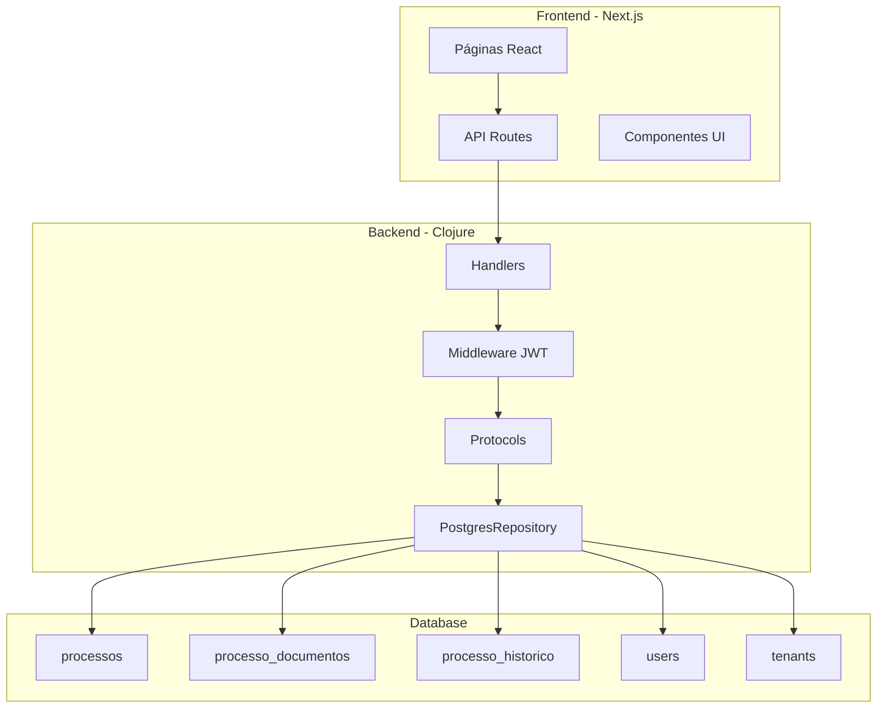

# Design Document - Gestão de Processos Jurídicos

## Visão Geral

Este documento descreve o design técnico para o sistema de gestão de processos jurídicos do Legal ERP. O sistema será implementado seguindo a arquitetura existente do projeto, com backend em Clojure e frontend em Next.js 14 com TypeScript.

### Objetivos do Design

- Implementar CRUD completo de processos jurídicos
- Garantir isolamento multi-tenant rigoroso
- Fornecer interface moderna e responsiva
- Manter histórico completo de alterações
- Suportar upload e gestão de documentos
- Implementar busca e filtros eficientes

### Princípios Arquiteturais

1. **Multi-tenancy**: Isolamento total de dados por tenant
2. **Segurança**: Validação de permissões em todas as camadas
3. **Auditoria**: Registro completo de todas as operações
4. **Performance**: Paginação e índices otimizados
5. **Usabilidade**: Interface intuitiva seguindo design system

---

## Arquitetura

### Stack Tecnológico

**Backend:**
- Clojure 1.11
- Ring/Reitit (HTTP server e routing)
- next.jdbc (Database access)
- Buddy (JWT e hashing)
- CockroachDB/PostgreSQL

**Frontend:**
- Next.js 14 (App Router)
- TypeScript
- React 18
- CSS Modules
- Design System estabelecido

### Diagrama de Arquitetura



### Fluxo de Dados

1. **Request Flow:**
   - Usuário interage com UI (Next.js)
   - API Routes do Next.js fazem chamadas HTTP para backend Clojure
   - Handlers Clojure processam requests
   - Middleware valida JWT e tenant_id
   - Protocols definem contratos de dados
   - Repository executa queries no banco

2. **Response Flow:**
   - Repository retorna dados do banco
   - Handlers formatam resposta
   - API Routes retornam JSON para frontend
   - UI renderiza dados

---

## Componentes e Interfaces

### Backend - Clojure

#### 1. Handlers (`src/juridico/api/handlers/processos.clj`)

Responsável por receber requests HTTP e orquestrar a lógica de negócio.

```clojure
(ns juridico.api.handlers.processos
  (:require [juridico.api.db.protocols :as db]
            [juridico.api.middleware :as middleware]
            [ring.util.response :as response]))

;; Handlers principais
(defn list-processos [request]
  "Lista processos com paginação e filtros")

(defn get-processo [request]
  "Retorna detalhes de um processo específico")

(defn create-processo [request]
  "Cria novo processo")

(defn update-processo [request]
  "Atualiza processo existente")

(defn delete-processo [request]
  "Soft delete de processo")

(defn search-processos [request]
  "Busca processos por termo")

(defn upload-documento [request]
  "Upload de documento para processo")

(defn list-documentos [request]
  "Lista documentos de um processo")

(defn get-historico [request]
  "Retorna histórico de alterações")
```

#### 2. Protocols (`src/juridico/api/db/protocols.clj`)

Define contratos para operações de dados.

```clojure
(defprotocol ProcessoRepository
  (find-all-processos [this tenant-id opts]
    "Lista processos com paginação e filtros
     opts: {:page 1 :per-page 20 :status nil :tipo nil :cliente-id nil}")
  
  (find-processo-by-id [this tenant-id processo-id]
    "Busca processo por ID validando tenant")
  
  (find-processo-by-numero [this tenant-id numero]
    "Busca processo por número validando tenant")
  
  (create-processo! [this processo-data]
    "Cria novo processo
     processo-data: {:tenant-id :numero-processo :cliente-id :tipo ...}")
  
  (update-processo! [this tenant-id processo-id updates]
    "Atualiza processo existente")
  
  (soft-delete-processo! [this tenant-id processo-id user-id]
    "Marca processo como deletado")
  
  (search-processos [this tenant-id query opts]
    "Busca full-text em processos")
  
  (add-historico! [this historico-data]
    "Adiciona entrada no histórico"))

(defprotocol DocumentoRepository
  (find-documentos-by-processo [this processo-id]
    "Lista documentos de um processo")
  
  (create-documento! [this documento-data]
    "Registra novo documento")
  
  (delete-documento! [this documento-id]
    "Remove documento"))
```

#### 3. Repository Implementation (`src/juridico/api/db/postgres.clj`)

Implementação concreta usando next.jdbc.

```clojure
(defrecord PostgresRepository [db-spec]
  ProcessoRepository
  
  (find-all-processos [this tenant-id opts]
    (let [{:keys [page per-page status tipo cliente-id]} opts
          offset (* (dec page) per-page)]
      (jdbc/execute! db-spec
        ["SELECT p.*, c.nome as cliente_nome
          FROM processos p
          LEFT JOIN clientes c ON p.cliente_id = c.id
          WHERE p.tenant_id = ? 
            AND p.deleted_at IS NULL
            AND (? IS NULL OR p.status = ?)
            AND (? IS NULL OR p.tipo = ?)
            AND (? IS NULL OR p.cliente_id = ?)
          ORDER BY p.created_at DESC
          LIMIT ? OFFSET ?"
         tenant-id status status tipo tipo cliente-id cliente-id per-page offset])))
  
  (find-processo-by-id [this tenant-id processo-id]
    (jdbc/execute-one! db-spec
      ["SELECT * FROM processos 
        WHERE id = ? AND tenant_id = ? AND deleted_at IS NULL"
       processo-id tenant-id]))
  
  ;; ... outras implementações
  )
```

#### 4. Middleware (`src/juridico/api/middleware.clj`)

Validações e autenticação.

```clojure
(defn wrap-tenant-validation
  "Valida que o tenant_id do JWT corresponde aos dados acessados"
  [handler]
  (fn [request]
    (let [tenant-id (get-in request [:claims :tenant-id])
          resource-tenant-id (get-in request [:params :tenant-id])]
      (if (or (nil? resource-tenant-id)
              (= tenant-id resource-tenant-id))
        (handler request)
        {:status 403 :body {:error "Acesso negado"}}))))

(defn wrap-permission-check
  "Verifica permissões do usuário para a operação"
  [handler required-permission]
  (fn [request]
    (let [role (get-in request [:claims :role])]
      (if (has-permission? role required-permission)
        (handler request)
        {:status 403 :body {:error "Permissão negada"}}))))
```

#### 5. Routes (`src/juridico/api/routes.clj`)

Definição de rotas com Reitit.

```clojure
(def processo-routes
  ["/api/processos"
   {:middleware [middleware/wrap-jwt-auth
                 middleware/wrap-tenant-validation]}
   
   ["" {:get {:handler handlers.processos/list-processos
              :middleware [(middleware/wrap-permission-check :read-processos)]}
        :post {:handler handlers.processos/create-processo
               :middleware [(middleware/wrap-permission-check :create-processos)]}}]
   
   ["/:id" {:get {:handler handlers.processos/get-processo}
            :put {:handler handlers.processos/update-processo
                  :middleware [(middleware/wrap-permission-check :update-processos)]}
            :delete {:handler handlers.processos/delete-processo
                     :middleware [(middleware/wrap-permission-check :delete-processos)]}}]
   
   ["/:id/documentos" {:get {:handler handlers.processos/list-documentos}
                       :post {:handler handlers.processos/upload-documento}}]
   
   ["/:id/historico" {:get {:handler handlers.processos/get-historico}}]
   
   ["/search" {:get {:handler handlers.processos/search-processos}}]])
```

---

### Frontend - Next.js

#### 1. Páginas

**`frontend-nextjs/src/app/processos/page.tsx`** - Listagem de processos

```typescript
'use client';

import { useState, useEffect } from 'react';
import { ProcessosList } from '@/components/processos/ProcessosList';
import { ProcessosFilters } from '@/components/processos/ProcessosFilters';
import { useAuth } from '@/hooks/useAuth';

export default function ProcessosPage() {
  const { user } = useAuth();
  const [processos, setProcessos] = useState([]);
  const [filters, setFilters] = useState({});
  const [loading, setLoading] = useState(true);

  useEffect(() => {
    loadProcessos();
  }, [filters]);

  const loadProcessos = async () => {
    // Fetch processos from API
  };

  return (
    <div>
      <ProcessosFilters onFilterChange={setFilters} />
      <ProcessosList processos={processos} loading={loading} />
    </div>
  );
}
```

**`frontend-nextjs/src/app/processos/[id]/page.tsx`** - Detalhes do processo

```typescript
'use client';

import { ProcessoDetails } from '@/components/processos/ProcessoDetails';
import { DocumentosList } from '@/components/processos/DocumentosList';
import { HistoricoTimeline } from '@/components/processos/HistoricoTimeline';

export default function ProcessoDetailsPage({ params }: { params: { id: string } }) {
  return (
    <div>
      <ProcessoDetails processoId={params.id} />
      <DocumentosList processoId={params.id} />
      <HistoricoTimeline processoId={params.id} />
    </div>
  );
}
```

**`frontend-nextjs/src/app/processos/novo/page.tsx`** - Criar processo

```typescript
'use client';

import { ProcessoForm } from '@/components/processos/ProcessoForm';

export default function NovoProcessoPage() {
  return <ProcessoForm mode="create" />;
}
```

#### 2. API Routes (BFF Pattern)

**`frontend-nextjs/src/app/api/processos/route.ts`**

```typescript
import { NextRequest, NextResponse } from 'next/server';
import { getServerSession } from 'next-auth';

export async function GET(request: NextRequest) {
  const session = await getServerSession();
  if (!session) {
    return NextResponse.json({ error: 'Unauthorized' }, { status: 401 });
  }

  const searchParams = request.nextUrl.searchParams;
  const page = searchParams.get('page') || '1';
  const status = searchParams.get('status');

  // Chamada para backend Clojure
  const response = await fetch(`${process.env.BACKEND_URL}/api/processos?page=${page}&status=${status}`, {
    headers: {
      'Authorization': `Bearer ${session.accessToken}`,
    },
  });

  const data = await response.json();
  return NextResponse.json(data);
}

export async function POST(request: NextRequest) {
  const session = await getServerSession();
  if (!session) {
    return NextResponse.json({ error: 'Unauthorized' }, { status: 401 });
  }

  const body = await request.json();

  const response = await fetch(`${process.env.BACKEND_URL}/api/processos`, {
    method: 'POST',
    headers: {
      'Authorization': `Bearer ${session.accessToken}`,
      'Content-Type': 'application/json',
    },
    body: JSON.stringify(body),
  });

  const data = await response.json();
  return NextResponse.json(data, { status: response.status });
}
```

#### 3. Componentes UI

**`frontend-nextjs/src/components/processos/ProcessosList.tsx`**

```typescript
import styles from './ProcessosList.module.css';
import { StatusBadge } from '@/components/ui/StatusBadge';

interface Processo {
  id: number;
  numero_processo: string;
  cliente_nome: string;
  tipo: string;
  status: string;
  created_at: string;
}

interface ProcessosListProps {
  processos: Processo[];
  loading: boolean;
}

export function ProcessosList({ processos, loading }: ProcessosListProps) {
  if (loading) return <div>Carregando...</div>;
  if (processos.length === 0) return <div>Nenhum processo cadastrado</div>;

  return (
    <div className={styles.container}>
      <table className={styles.table}>
        <thead>
          <tr>
            <th>Número</th>
            <th>Cliente</th>
            <th>Tipo</th>
            <th>Status</th>
            <th>Data</th>
            <th>Ações</th>
          </tr>
        </thead>
        <tbody>
          {processos.map(processo => (
            <tr key={processo.id}>
              <td>{processo.numero_processo}</td>
              <td>{processo.cliente_nome}</td>
              <td>{processo.tipo}</td>
              <td><StatusBadge status={processo.status} /></td>
              <td>{new Date(processo.created_at).toLocaleDateString()}</td>
              <td>
                <a href={`/processos/${processo.id}`}>Ver detalhes</a>
              </td>
            </tr>
          ))}
        </tbody>
      </table>
    </div>
  );
}
```

**`frontend-nextjs/src/components/processos/ProcessoForm.tsx`**

```typescript
'use client';

import { useState } from 'react';
import styles from './ProcessoForm.module.css';

interface ProcessoFormProps {
  mode: 'create' | 'edit';
  initialData?: any;
}

export function ProcessoForm({ mode, initialData }: ProcessoFormProps) {
  const [formData, setFormData] = useState(initialData || {});
  const [loading, setLoading] = useState(false);

  const handleSubmit = async (e: React.FormEvent) => {
    e.preventDefault();
    setLoading(true);

    const url = mode === 'create' 
      ? '/api/processos' 
      : `/api/processos/${initialData.id}`;
    
    const method = mode === 'create' ? 'POST' : 'PUT';

    const response = await fetch(url, {
      method,
      headers: { 'Content-Type': 'application/json' },
      body: JSON.stringify(formData),
    });

    if (response.ok) {
      // Redirect ou mostrar sucesso
    }

    setLoading(false);
  };

  return (
    <form onSubmit={handleSubmit} className={styles.form}>
      <div className={styles.field}>
        <label>Número do Processo *</label>
        <input
          type="text"
          value={formData.numero_processo || ''}
          onChange={e => setFormData({...formData, numero_processo: e.target.value})}
          required
        />
      </div>

      <div className={styles.field}>
        <label>Cliente *</label>
        <select
          value={formData.cliente_id || ''}
          onChange={e => setFormData({...formData, cliente_id: e.target.value})}
          required
        >
          <option value="">Selecione...</option>
          {/* Carregar clientes */}
        </select>
      </div>

      <div className={styles.field}>
        <label>Tipo *</label>
        <input
          type="text"
          value={formData.tipo || ''}
          onChange={e => setFormData({...formData, tipo: e.target.value})}
          required
        />
      </div>

      <div className={styles.field}>
        <label>Vara/Tribunal</label>
        <input
          type="text"
          value={formData.vara_tribunal || ''}
          onChange={e => setFormData({...formData, vara_tribunal: e.target.value})}
        />
      </div>

      <button type="submit" disabled={loading}>
        {loading ? 'Salvando...' : mode === 'create' ? 'Criar Processo' : 'Salvar Alterações'}
      </button>
    </form>
  );
}
```

---

## Modelo de Dados

### Tabelas do Banco de Dados

#### 1. `processos`

Tabela principal de processos jurídicos.

```sql
CREATE TABLE processos (
  id BIGINT PRIMARY KEY DEFAULT unique_rowid(),
  tenant_id BIGINT NOT NULL REFERENCES tenants(id) ON DELETE CASCADE,
  numero_processo VARCHAR(50) NOT NULL,
  cliente_id BIGINT NOT NULL REFERENCES clientes(id),
  tipo VARCHAR(100) NOT NULL,
  vara_tribunal VARCHAR(200),
  comarca VARCHAR(100),
  uf VARCHAR(2),
  status VARCHAR(50) DEFAULT 'Em Andamento',
  valor_causa DECIMAL(15,2),
  data_distribuicao DATE,
  descricao TEXT,
  observacoes TEXT,
  created_by BIGINT REFERENCES users(id),
  updated_by BIGINT REFERENCES users(id),
  deleted_by BIGINT REFERENCES users(id),
  created_at TIMESTAMPTZ DEFAULT NOW(),
  updated_at TIMESTAMPTZ DEFAULT NOW(),
  deleted_at TIMESTAMPTZ,
  CONSTRAINT unique_processo_tenant UNIQUE(tenant_id, numero_processo)
);

CREATE INDEX idx_processos_tenant ON processos(tenant_id);
CREATE INDEX idx_processos_cliente ON processos(cliente_id);
CREATE INDEX idx_processos_status ON processos(status);
CREATE INDEX idx_processos_numero ON processos(numero_processo);
CREATE INDEX idx_processos_deleted ON processos(deleted_at) WHERE deleted_at IS NULL;
```

#### 2. `processo_documentos`

Armazena metadados de documentos anexados aos processos.

```sql
CREATE TABLE processo_documentos (
  id BIGINT PRIMARY KEY DEFAULT unique_rowid(),
  processo_id BIGINT NOT NULL REFERENCES processos(id) ON DELETE CASCADE,
  nome_arquivo VARCHAR(255) NOT NULL,
  tipo_arquivo VARCHAR(50),
  tamanho_bytes BIGINT,
  caminho_storage VARCHAR(500) NOT NULL,
  uploaded_by BIGINT REFERENCES users(id),
  created_at TIMESTAMPTZ DEFAULT NOW(),
  deleted_at TIMESTAMPTZ
);

CREATE INDEX idx_processo_docs_processo ON processo_documentos(processo_id);
CREATE INDEX idx_processo_docs_deleted ON processo_documentos(deleted_at) WHERE deleted_at IS NULL;
```

#### 3. `processo_historico`

Auditoria de todas as alterações em processos.

```sql
CREATE TABLE processo_historico (
  id BIGINT PRIMARY KEY DEFAULT unique_rowid(),
  processo_id BIGINT NOT NULL REFERENCES processos(id) ON DELETE CASCADE,
  user_id BIGINT REFERENCES users(id),
  acao VARCHAR(50) NOT NULL,
  campo_alterado VARCHAR(100),
  valor_anterior TEXT,
  valor_novo TEXT,
  created_at TIMESTAMPTZ DEFAULT NOW()
);

CREATE INDEX idx_processo_hist_processo ON processo_historico(processo_id);
CREATE INDEX idx_processo_hist_created ON processo_historico(created_at DESC);
```

#### 4. `clientes` (Tabela Futura)

Será necessária para vincular processos a clientes.

```sql
CREATE TABLE clientes (
  id BIGINT PRIMARY KEY DEFAULT unique_rowid(),
  tenant_id BIGINT NOT NULL REFERENCES tenants(id) ON DELETE CASCADE,
  nome VARCHAR(255) NOT NULL,
  cpf_cnpj VARCHAR(20),
  email VARCHAR(255),
  telefone VARCHAR(20),
  endereco TEXT,
  created_at TIMESTAMPTZ DEFAULT NOW(),
  updated_at TIMESTAMPTZ DEFAULT NOW(),
  deleted_at TIMESTAMPTZ
);

CREATE INDEX idx_clientes_tenant ON clientes(tenant_id);
CREATE UNIQUE INDEX idx_clientes_cpf_tenant ON clientes(tenant_id, cpf_cnpj) WHERE deleted_at IS NULL;
```

### Relacionamentos

```
tenants (1) ──────── (N) processos
tenants (1) ──────── (N) clientes
users (1) ──────── (N) processos (created_by)
clientes (1) ──────── (N) processos
processos (1) ──────── (N) processo_documentos
processos (1) ──────── (N) processo_historico
```

---

## Tratamento de Erros

### Backend - Clojure

```clojure
(defn handle-error [e]
  (cond
    (instance? java.sql.SQLException e)
    {:status 500 :body {:error "Erro no banco de dados"}}
    
    (instance? clojure.lang.ExceptionInfo e)
    (let [data (ex-data e)]
      {:status (:status data 400) :body {:error (:message data)}})
    
    :else
    {:status 500 :body {:error "Erro interno do servidor"}}))

(defn wrap-error-handling [handler]
  (fn [request]
    (try
      (handler request)
      (catch Exception e
        (handle-error e)))))
```

### Validações

```clojure
(defn validate-processo [processo-data]
  (cond
    (nil? (:numero-processo processo-data))
    (throw (ex-info "Número do processo é obrigatório" {:status 400}))
    
    (nil? (:cliente-id processo-data))
    (throw (ex-info "Cliente é obrigatório" {:status 400}))
    
    (nil? (:tipo processo-data))
    (throw (ex-info "Tipo é obrigatório" {:status 400}))
    
    :else processo-data))
```

### Frontend - Next.js

```typescript
export async function handleApiError(response: Response) {
  if (!response.ok) {
    const error = await response.json();
    throw new Error(error.error || 'Erro desconhecido');
  }
  return response.json();
}

// Uso
try {
  const data = await fetch('/api/processos')
    .then(handleApiError);
} catch (error) {
  toast.error(error.message);
}
```

---

## Estratégia de Testes

### Backend - Clojure

#### 1. Testes Unitários

```clojure
(ns juridico.api.handlers.processos-test
  (:require [clojure.test :refer :all]
            [juridico.api.handlers.processos :as processos]))

(deftest test-validate-processo
  (testing "Validação de processo válido"
    (is (= {:numero-processo "123" :cliente-id 1 :tipo "Cível"}
           (processos/validate-processo 
             {:numero-processo "123" :cliente-id 1 :tipo "Cível"}))))
  
  (testing "Validação falha sem número"
    (is (thrown? Exception
          (processos/validate-processo {:cliente-id 1 :tipo "Cível"})))))
```

#### 2. Testes de Integração

```clojure
(deftest test-create-processo-integration
  (with-test-db [db]
    (let [tenant-id 1
          user-id 1
          processo-data {:tenant-id tenant-id
                        :numero-processo "123/2025"
                        :cliente-id 1
                        :tipo "Cível"
                        :created-by user-id}
          result (db/create-processo! db processo-data)]
      (is (some? (:id result)))
      (is (= "123/2025" (:numero-processo result))))))
```

### Frontend - Next.js

#### 1. Testes de Componentes

```typescript
import { render, screen } from '@testing-library/react';
import { ProcessosList } from './ProcessosList';

describe('ProcessosList', () => {
  it('renders empty state', () => {
    render(<ProcessosList processos={[]} loading={false} />);
    expect(screen.getByText('Nenhum processo cadastrado')).toBeInTheDocument();
  });

  it('renders processos list', () => {
    const processos = [
      { id: 1, numero_processo: '123', cliente_nome: 'João', tipo: 'Cível', status: 'Ativo', created_at: '2025-01-01' }
    ];
    render(<ProcessosList processos={processos} loading={false} />);
    expect(screen.getByText('123')).toBeInTheDocument();
  });
});
```

---

## Segurança

### 1. Autenticação e Autorização

- JWT tokens validados em todas as requisições
- Tenant ID extraído do token e validado
- Permissões verificadas por role (master/operador)

### 2. Validação de Tenant

```clojure
(defn ensure-tenant-access [tenant-id-from-token tenant-id-from-resource]
  (when (not= tenant-id-from-token tenant-id-from-resource)
    (throw (ex-info "Acesso negado" {:status 403}))))
```

### 3. SQL Injection Prevention

- Uso de prepared statements (next.jdbc)
- Validação de inputs
- Sanitização de queries

### 4. Upload de Arquivos

- Validação de tipo de arquivo (whitelist)
- Limite de tamanho (10MB)
- Armazenamento seguro (S3 ou filesystem isolado)
- Scan de vírus (futuro)

---

## Performance

### 1. Paginação

- Limite de 20 processos por página
- Offset-based pagination
- Contagem total otimizada

### 2. Índices

- Índices em tenant_id, cliente_id, status, numero_processo
- Partial index em deleted_at para soft deletes

### 3. Caching (Futuro)

- Redis para cache de listagens
- Invalidação ao criar/atualizar/deletar
- TTL de 5 minutos

### 4. N+1 Queries Prevention

- JOINs para carregar dados relacionados
- Eager loading de clientes na listagem

---

## Deployment

### 1. Migrations

Script de migration para criar tabelas:

```sql
-- migrations/003_create_processos_tables.sql

BEGIN;

CREATE TABLE IF NOT EXISTS processos (
  -- schema completo aqui
);

CREATE TABLE IF NOT EXISTS processo_documentos (
  -- schema completo aqui
);

CREATE TABLE IF NOT EXISTS processo_historico (
  -- schema completo aqui
);

COMMIT;
```

### 2. Rollback Plan

```sql
-- migrations/003_rollback_processos_tables.sql

BEGIN;

DROP TABLE IF EXISTS processo_historico;
DROP TABLE IF EXISTS processo_documentos;
DROP TABLE IF EXISTS processos;

COMMIT;
```

### 3. Environment Variables

```bash
# Backend
DATABASE_URL=postgresql://...
JWT_SECRET=...
UPLOAD_PATH=/var/uploads

# Frontend
NEXT_PUBLIC_API_URL=http://localhost:3000
BACKEND_URL=http://localhost:8080
```

---

## Monitoramento e Logs

### 1. Logging

```clojure
(require '[taoensso.timbre :as log])

(defn create-processo [request]
  (log/info "Creating processo" {:tenant-id (:tenant-id request)
                                  :user-id (:user-id request)})
  (try
    (let [result (db/create-processo! ...)]
      (log/info "Processo created successfully" {:processo-id (:id result)})
      result)
    (catch Exception e
      (log/error e "Failed to create processo")
      (throw e))))
```

### 2. Métricas

- Tempo de resposta de endpoints
- Taxa de erro
- Número de processos criados/dia
- Uso de storage (documentos)

---

## Próximos Passos

1. ✅ Criar migrations do banco de dados
2. ✅ Implementar protocols e repository
3. ✅ Criar handlers e routes
4. ✅ Implementar API routes no Next.js
5. ✅ Criar componentes UI
6. ✅ Implementar upload de arquivos
7. ✅ Adicionar testes
8. ✅ Deploy e monitoramento

---

**Versão**: 1.0  
**Data**: 04/11/2025  
**Status**: Pronto para implementação
